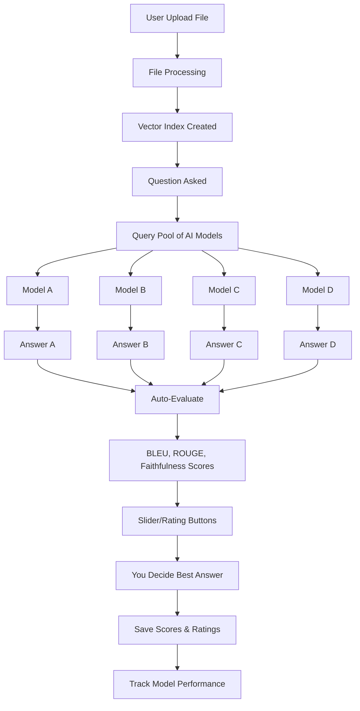

# MultiLLM RAG Chatbot

**Submitted to:**
- Professor. Roberto Pietrantuono

**Submitted by:**
- Mohammed Zain Shaikh, 
- Sahaya Muthukani Gnanadurai
- Nimra Jabeen


## Introduction

It is a smart chatbot that lets you upload any file (PDF, text, documents, etc.) and ask questions about it. The unique feature: **it asks multiple AI models the same question at the same time** and shows you all their answers side-by-side so you can compare and pick the best one.

You can rate each answer with a score or thumbs up/down to help track which AI models give you the best results.

---

## Workflow

```
Your File → Read & Index → Your Question → Query Multiple AIs → Compare Answers → You Rate & Rank
```

### Step by Step

**1. Upload Your File**
- Click upload and choose any file (PDF, Word, text, images, etc.)
- System reads and indexes the content
- Creates a searchable database

**2. Ask a Question**
- Type your question in the chatbox
- Choose how many AI models to ask (2-6 models)

**3. Get Multiple Answers**
- All selected AI models answer your question at the same time
- Each answer appears in a separate card
- Automatic evaluation metrics shown (BLEU, ROUGE, Faithfulness, etc.)

**4. Compare & Rate**
- Read all answers side-by-side
- See which parts of your file each AI found
- Use the **rating slider** or **thumbs up/down** to score each answer
- Track which AI models perform best for your use case

**5. Save Scores**
- Your ratings are saved
- System learns which models work best for you
- View rating history anytime

---

## Available AI Models

The chatbot can query these AI models:

| Model | Provider |
|-------|----------|
| GPT-4o | OpenAI |
| GPT-4o Mini | OpenAI |
| Claude Sonnet 4 | Anthropic |
| Claude Haiku 3.5 | Anthropic |
| Gemini 2.0 Flash | Google |
| Llama 3.3 70B | Meta |
| DeepSeek Chat v3 | DeepSeek |
| Mistral Large 2411 | Mistral |

Pick any combination to compare.

---

## Evaluation Metrics (Reference Only)

These metrics are calculated automatically to help you evaluate answers:

| Metric | Meaning |
|--------|---------|
| **BLEU** | How many words match between answers (0-1) |
| **ROUGE** | How similar the answers are in structure (0-1) |
| **Faithfulness** | Does the answer match your uploaded file content? (0-1) |
| **Answer Relevancy** | Does the answer address your question? (0-1) |
| **Context Precision** | Are retrieved file sections relevant? (0-1) |
| **Context Recall** | Were all important file sections found? (0-1) |

**Your Human Rating:** You can override these metrics with your own scoring (1-10 or thumbs up/down).

---

## How Ratings Work

### Option 1: Slider Rating
- Drag a slider from 1-10 for each answer
- 1 = Bad, 10 = Excellent

### Option 2: Thumbs Up/Down
- Click thumbs up if answer is good
- Click thumbs down if answer is bad
- Or skip rating

### Option 3: Input Field
- Type a score (1-10, 0-100, or custom scale)
- Add notes explaining why you rated it that way

Your ratings are saved with timestamps so you can track which models perform best over time.

---

## Directory Structure

```
MultiLLM-RAG-Chatbot/
├── Dockerfile                    # Container image
├── docker-compose.yml            # Docker setup
├── run.sh                        # One-command start
├── .env                          # API keys and settings
│
├── app/                          # Application code
│   ├── main.py                   # Web server & API
│   ├── config.py                 # Settings
│   ├── database.py               # Store chats & ratings
│   ├── file_processor.py         # Read any file type
│   ├── embeddings.py             # Vector search
│   ├── llm_client.py             # Connect to AI models
│   ├── ratings.py                # Handle user scores
│   ├── requirements.txt          # Python packages
│   ├── templates/
│   │   └── index.html            # Web interface
│   └── static/
│       ├── css/style.css
│       └── js/app.js
│
├── data/                         # Files & databases
│   ├── uploads/                  # Your uploaded files
│   ├── indices/                  # Search indexes
│   └── chats/                    # Chat history
│
└── venv/                         # Python environment
```

---

## Quick Start

```bash
cd /path/to/MultiLLM-RAG-Chatbot
chmod +x run.sh
./run.sh
```

Done! Open your browser to: **http://localhost:8000**

The `run.sh` script handles:
- Python setup
- Installing packages
- Starting database
- Launching the web server

---

## Browser Interface

### Left Side
- **File Upload** - Upload your file
- **File List** - Your uploaded documents

### Right Side (Main Chat)
- **Question Box** - Type your question
- **Model Selection** - Pick 2-6 AI models to query
- **Send Button** - Query all selected models

### Results Section
Each AI model's answer appears in a separate card with:
- **Model name** at the top
- **Answer text** in the middle
- **Auto-metrics** (BLEU, ROUGE, Faithfulness, etc.) shown
- **Rating slider/thumbs** at the bottom to score it
- **Response time** shown

---

## What Data Gets Saved

- Your uploaded files (stored locally, not sent anywhere)
- Your questions and chat history
- All AI responses
- Your human ratings/scores
- Timestamps for analysis

All data is stored in a local PostgreSQL database on your computer.

---

## Use Cases

**1. Compare AI models for your work**
- Upload your documents
- Ask the same question to multiple models
- See which one understands your files best

**2. Quality control**
- Check if AI answers match your source material
- Rate consistency and accuracy
- Track improvements over time

**3. Training / Learning**
- Understand how different AI models think
- See different perspectives on the same question
- Learn which model is best for which topics

**4. Research**
- Compare LLM outputs systematically
- Keep records of model performance
- Export ratings for analysis

---

## Why This Design?

Traditional chatbots show you one answer. This system shows you **all answers at once** so you can:

✓ Compare directly (faster decision making)
✓ Rate based on your needs (human judgment)
✓ Track model performance over time (data-driven)
✓ Find the best model for your use case (personalized)
✓ Understand AI differences (educational)

---

## File Upload Types Supported

- **Documents**: PDF, DOCX, DOC, TXT, RTF
- **Spreadsheets**: XLSX, CSV, XLS
- **Web**: HTML, Markdown, JSON
- **Images**: JPG, PNG, GIF (text extraction via OCR)
- **Other**: Any text-based format

The system reads the content and creates a searchable index automatically.

---

## Architecture Overview



---

## Rating Examples

### Example 1: Simple Thumbs
```
Claude Sonnet 4:  "The answer is..." ⬆️ (Thumbs up)
GPT-4o:          "The answer is..." ⬇️ (Thumbs down)
Llama 3.3:       "The answer is..." ⬆️⬆️ (You liked this more)
```

### Example 2: Numeric Score
```
Claude Sonnet 4: 8/10 - "Clear and accurate"
GPT-4o:         5/10 - "Missing important details"
Llama 3.3:      9/10 - "Best explanation so far"
```

### Example 3: Custom Scale
```
Claude Sonnet 4: 8/10 - Professional, good for business
GPT-4o:         6/10 - Okay, but too technical
Llama 3.3:      7/10 - Good balance
```

---

## Key Features

| Feature | What It Does |
|---------|-------------|
| **Multi-Model Query** | Ask 2-6 AI models at the same time |
| **Side-by-Side Comparison** | View all answers together |
| **Auto Metrics** | See BLEU, ROUGE, Faithfulness scores |
| **Human Rating** | Override metrics with your own scores |
| **Rating History** | Track which models you rated best |
| **File Management** | Upload and manage multiple documents |
| **Chat History** | Revisit past questions and answers |
| **Local Storage** | Everything stays on your computer |

---

## Technology Stack

- **Backend**: FastAPI (Python web framework)
- **Database**: PostgreSQL (store chats, ratings, files)
- **Search**: FAISS (find relevant content in files)
- **Embeddings**: Sentence Transformers (understand meaning)
- **AI Models**: OpenRouter API (access 8+ AI models)
- **Frontend**: HTML, CSS, JavaScript (simple web interface)
- **Deployment**: Docker (run anywhere)

---

## Next Steps

1. **Run the chatbot**: `./run.sh`
2. **Upload a file** of any type
3. **Ask a question** you want answered
4. **Compare answers** from multiple AI models
5. **Rate the answers** using the slider or thumbs
6. **Track performance** over time

---

*MultiLLM RAG Chatbot - Compare AI outputs, rate what works best for you.*

**Version**: 2.0.0 | **Type**: Multi-Model Comparison Chatbot | **Status**: Ready to Use
